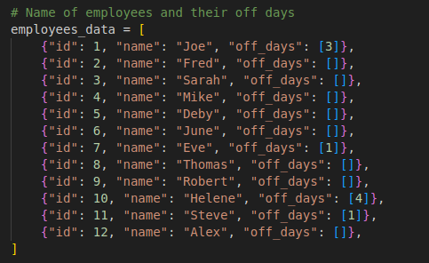
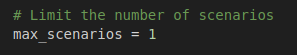
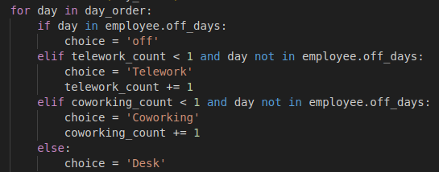
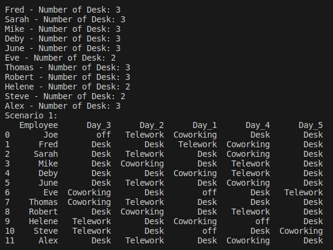
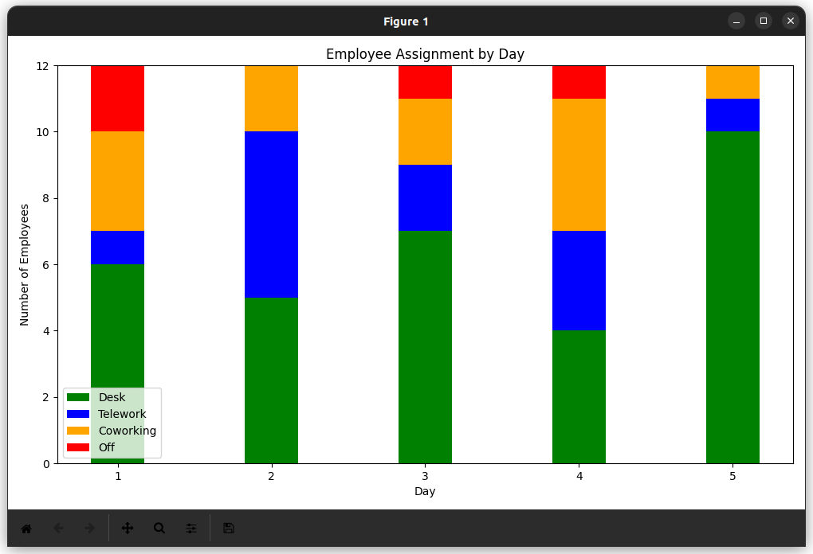

# Employee-location-optimization
Generates scenarios based on employees' days off to optimize the number of offices

## Requirements
pandas
random
matplotlib.pyplot

## Notice
### Employees datas
First, you can rename employees and specify if they have days when they don't work during the week.

### Scenarios
You can choose the number of scenarios to generate. Note that only the first scenario will be displayed on the graph.

### Constraints
You can define the number of teleworking days or the constraint you want.

### See the result
Run the script and see the result: you have the number of offices you need, an employee distribution scenario and a graph to illustrate this.

